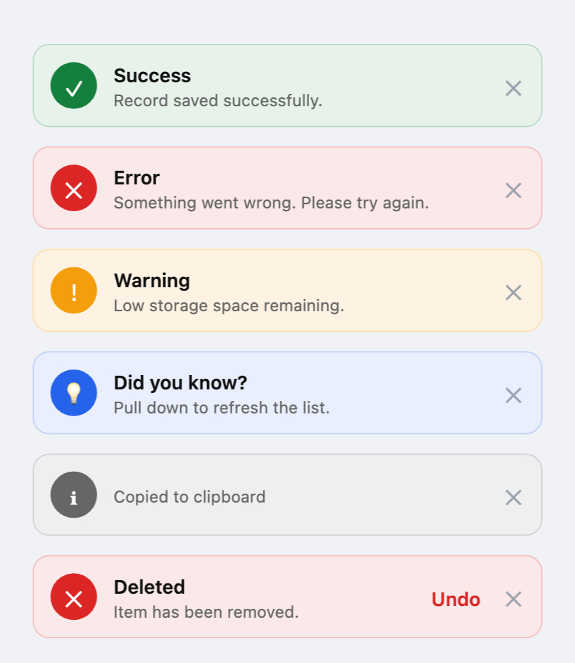

# top_toast

A beautiful top-sliding overlay **toast** / **snackbar** notification and confirmation **dialog** package for Flutter.

- Five built-in types: **success**, **error**, **warning**, **info**, **neutral**
- **Light & dark mode** — auto-detects system theme; force with `lightBuilder` / `darkBuilder`
- **6 positions** — `top` / `bottom` for mobile; corner variants for web & desktop
- **3 animation styles** — slide, scale, fade (per-toast override supported)
- **Progress bar** — optional countdown bar at the bottom of the card
- **Toast queue & stack** — queue toasts or show multiple simultaneously
- **Persistent toasts** — opt-out of auto-dismiss
- **onTap callback** — run any action when the toast body is tapped
- **Custom icon & colours** — override per toast
- **Hover-pause** — auto-dismiss timer pauses on mouse hover (web/desktop)
- **Haptic feedback** — light pulse on show (configurable)
- **Swipe to dismiss** — vertical swipe for top/bottom; horizontal for corners
- **`dismissAll()`** — clear every visible toast and the queue instantly
- Always renders **above dialogs and bottom sheets**
- **Confirmation dialogs** — `delete`, `warning`, `success`, `failed`, `confirmation`, `custom` types with custom-painted icons
- **Async confirm** — button shows spinner while your async action runs
- Zero dependencies beyond Flutter itself

---

## Platform Support

| Android | iOS | Web | macOS |
|:-------:|:---:|:---:|:-----:|
| ✅ | ✅ | ✅ | ✅ |

---

## Preview

[](https://html-preview.github.io/?url=https%3A%2F%2Fgithub.com%2Fdhruvin2004%2Ftop_toast%2Fblob%2Fmain%2Fscreenshots%2Ftoast_preview.html)

---

## Setup

### 1. Add to `pubspec.yaml`

```yaml
dependencies:
  top_toast: ^1.0.0
```

### 2. Initialise and wire up the builder

#### With `MaterialApp`

```dart
final navigatorKey = GlobalKey<NavigatorState>();

void main() {
  TopToast.init(navigatorKey: navigatorKey);
  runApp(MyApp());
}

class MyApp extends StatelessWidget {
  @override
  Widget build(BuildContext context) {
    return MaterialApp(
      navigatorKey: navigatorKey,
      builder: TopToast.builder,         // auto light/dark, above dialogs & sheets
      // builder: TopToast.lightBuilder, // force light
      // builder: TopToast.darkBuilder,  // force dark
      home: HomePage(),
    );
  }
}
```

#### With `MaterialApp.router` (e.g. GoRouter)

```dart
import 'package:go_router/go_router.dart';

final navigatorKey = GlobalKey<NavigatorState>();

final router = GoRouter(
  navigatorKey: navigatorKey,   // ← key goes here, not on MaterialApp.router
  routes: [
    GoRoute(path: '/', builder: (context, state) => HomePage()),
  ],
);

void main() {
  TopToast.init(navigatorKey: navigatorKey);
  runApp(MyApp());
}

class MyApp extends StatelessWidget {
  @override
  Widget build(BuildContext context) {
    return MaterialApp.router(
      routerConfig: router,
      builder: TopToast.builder,         // auto light/dark, above dialogs & sheets
      // builder: TopToast.lightBuilder,
      // builder: TopToast.darkBuilder,
    );
  }
}
```

---

## Usage

```dart
// Basic types
TopToast.success(msg: 'Record saved successfully.');
TopToast.error(msg: 'Something went wrong.');
TopToast.warning(msg: 'Low storage space remaining.');
TopToast.info(msg: 'Pull down to refresh the list.');
TopToast.toast(msg: 'Copied to clipboard');

// With custom title
TopToast.success(title: 'Done!', msg: 'Your profile has been updated.');

// With action button
TopToast.toastWithAction(
  type: ToastType.error,
  title: 'Deleted',
  msg: 'Item has been removed.',
  label: 'Undo',
  onPressed: () => TopToast.success(msg: 'Restored!'),
);

// onTap callback — called when the toast body is tapped
TopToast.info(msg: 'New message', onTap: () => openInbox());

// Persistent — does not auto-dismiss
TopToast.error(msg: 'No internet connection', persistent: true);

// Custom duration
TopToast.success(msg: 'Saved!', duration: const Duration(seconds: 5));

// Progress bar (per-toast override)
TopToast.warning(msg: 'Uploading…', showProgressBar: true);

// Custom icon & colours
TopToast.toast(
  msg: 'Syncing in the background…',
  icon: Icons.sync_rounded,
  cardColor: const Color(0xFF1E1B4B),
  iconBgColor: const Color(0xFF4F46E5),
);

// Per-toast position override
TopToast.success(msg: 'Saved!', position: ToastPosition.topRight);

// Per-toast animation override
TopToast.info(msg: 'Hello!', animation: ToastAnimation.scale);

// Dismiss everything instantly
TopToast.dismissAll();
```

---

## Global config via `TopToastConfig`

Pass a `TopToastConfig` to `TopToast.init` to set defaults for the whole app.
Individual toast calls can still override any field.

```dart
TopToast.init(
  navigatorKey: navigatorKey,
  config: const TopToastConfig(
    position:        ToastPosition.topRight,   // default position
    animation:       ToastAnimation.slide,     // slide | scale | fade
    defaultDuration: Duration(seconds: 4),
    showProgressBar: true,                     // countdown bar on every toast
    hapticFeedback:  true,                     // light haptic on show
    queueMode:       false,                    // true = queue, false = replace
    stackMode:       false,                    // true = show multiple at once
    maxStack:        3,                        // max simultaneous toasts
    stackSpacing:    80,                       // px per stacked slot
    maxWidth:        480,                      // full-width toast max width
    cornerWidth:     340,                      // corner toast width
  ),
);
```

### Queue mode vs Stack mode

| Mode | Behaviour |
|------|-----------|
| default (`queueMode: false`, `stackMode: false`) | New toast instantly replaces the current one |
| `queueMode: true` | Toasts wait in line; shown one at a time |
| `stackMode: true` | Up to `maxStack` toasts visible simultaneously |
| `stackMode: true` + `queueMode: true` | Stack fills up to `maxStack`; extras are queued |

---

## Position

| Value | Best for | Behaviour |
|-------|----------|-----------|
| `top` *(default)* | Mobile | Full-width banner, slides from top |
| `bottom` | Mobile | Full-width banner, slides from bottom |
| `topLeft` | Web / desktop | Corner popup, slides from top |
| `topRight` | Web / desktop | Corner popup, slides from top |
| `bottomLeft` | Web / desktop | Corner popup, slides from bottom |
| `bottomRight` | Web / desktop | Corner popup, slides from bottom |

---

## Builder options

| Builder | Theme |
|---------|-------|
| `TopToast.builder` | Auto — follows `MediaQuery.platformBrightness` |
| `TopToast.lightBuilder` | Always light |
| `TopToast.darkBuilder` | Always dark |

---

## API reference

### `TopToast.init({required navigatorKey, config})`
Call once in `main()`. Accepts an optional `TopToastConfig`.

### `TopToast.dismissAll()`
Removes all visible toasts and clears the queue.

### `TopToast.success / error / warning / info / toast`

| Parameter | Type | Default | Description |
|-----------|------|---------|-------------|
| `msg` | `String` | required | Body message |
| `title` | `String?` | type name | Optional title (not on `toast`) |
| `position` | `ToastPosition?` | config | Per-toast position override |
| `duration` | `Duration?` | config | Auto-dismiss duration |
| `persistent` | `bool` | `false` | Skip auto-dismiss |
| `onTap` | `VoidCallback?` | — | Called when toast body is tapped |
| `icon` | `IconData?` | type icon | Custom icon |
| `cardColor` | `Color?` | theme | Custom card background |
| `borderColor` | `Color?` | theme | Custom border |
| `iconBgColor` | `Color?` | theme | Custom icon circle background |
| `iconColor` | `Color?` | `white` | Custom icon colour |
| `actionColor` | `Color?` | theme | Custom action text colour |
| `animation` | `ToastAnimation?` | config | Per-toast animation override |
| `showProgressBar` | `bool?` | config | Show / hide progress bar |

### `TopToast.toastWithAction`
All parameters above plus:

| Parameter | Type | Required | Description |
|-----------|------|----------|-------------|
| `label` | `String` | ✅ | Action button label |
| `onPressed` | `VoidCallback` | ✅ | Action button callback |
| `type` | `ToastType` | — | Defaults to `neutral` |

---

## Behaviour

- Only one toast visible at a time by default; new toast replaces the current.
- Enable `queueMode` or `stackMode` in `TopToastConfig` to change this.
- Auto-dismisses after `defaultDuration` (3 s by default).
- **Tap** the toast body to dismiss (and fire `onTap` if set).
- **Swipe up/down** (top/bottom positions) or **swipe left/right** (corner positions) to dismiss early.
- **Hover** (web/desktop) pauses the auto-dismiss timer.
- `persistent: true` disables auto-dismiss entirely.

---

## Confirmation Dialogs

`TopDialog` is a zero-dependency confirmation dialog with six built-in variants, smooth scale+fade animation, and an async confirm flow.

### Dialog types

| Type | Accent | Icon | Default title | Shows cancel? |
|------|--------|------|---------------|:-------------:|
| `delete` | Red | Trash | Delete? | ✅ |
| `warning` | Amber | Triangle+! | Warning | ✅ |
| `success` | Green | Checkmark | Success! | ❌ |
| `failed` | Red | ✕ | Failed | ❌ |
| `confirmation` | Blue | ? | Are you sure? | ✅ |
| `custom` | *your color* | *your widget* | *(empty)* | ✅ |

### Usage

```dart
import 'package:top_toast/top_toast.dart';

// Sync confirm
TopDialog.show(
  context,
  type: DialogType.delete,
  message: 'This item will be permanently removed.',
  onConfirm: () => deleteItem(),
);

// Async confirm — spinner shown on button until future resolves
TopDialog.show(
  context,
  type: DialogType.confirmation,
  title: 'Submit report?',
  message: 'This will notify your manager.',
  onAsyncConfirm: () async {
    await api.submitReport();
  },
);

// Custom type — supply your own icon widget and accent color
TopDialog.show(
  context,
  type: DialogType.custom,
  title: 'Upload photo?',
  message: 'Your avatar will be updated immediately.',
  accentColor: const Color(0xFF7C3AED),
  customIcon: const Icon(Icons.upload, color: Colors.white, size: 22),
  onConfirm: () => uploadPhoto(),
);

// With cancel callback
TopDialog.show(
  context,
  type: DialogType.warning,
  message: 'Unsaved changes will be lost.',
  onConfirm: () => discardChanges(),
  onCancel: () => print('kept editing'),
);
```

### `TopDialogConfig` — app-wide defaults

Pass a `TopDialogConfig` instance to override defaults for any call:

```dart
TopDialog.show(
  context,
  type: DialogType.delete,
  message: 'Cannot be undone.',
  config: const TopDialogConfig(
    cancelLabel: 'Keep',
    confirmLabel: 'Delete forever',
    maxWidth: 320,
    barrierDismissible: false,
  ),
  onConfirm: () => deleteForever(),
);
```

| Parameter | Type | Default | Description |
|-----------|------|---------|-------------|
| `cancelLabel` | `String` | `'Cancel'` | Text for the cancel button |
| `confirmLabel` | `String?` | type default | Text for the confirm button |
| `showCancel` | `bool?` | type default | Show or hide the cancel button |
| `maxWidth` | `double` | `360` | Max width of the dialog card |
| `barrierDismissible` | `bool` | `true` | Tap barrier to close |

### `TopDialog.show` parameters

| Parameter | Type | Description |
|-----------|------|-------------|
| `type` | `DialogType` | required — one of the six variants |
| `title` | `String?` | Overrides type default title |
| `message` | `String?` | Body text (optional) |
| `confirmLabel` | `String?` | Overrides config/type default |
| `cancelLabel` | `String?` | Overrides config default |
| `showCancel` | `bool?` | Overrides config/type default |
| `barrierDismissible` | `bool?` | Overrides config default |
| `onConfirm` | `VoidCallback?` | Called synchronously; dialog closes |
| `onAsyncConfirm` | `Future<void> Function()?` | Spinner on button; closes when done |
| `onCancel` | `VoidCallback?` | Called when cancel is tapped |
| `accentColor` | `Color?` | Overrides type accent (`custom` type) |
| `customIcon` | `Widget?` | Icon widget for `custom` type |
| `config` | `TopDialogConfig` | App-wide defaults |

> **Note:** supply at least `onConfirm` or `onAsyncConfirm`.

---

## License

MIT — see [LICENSE](LICENSE).
